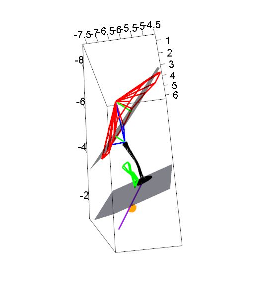

# Ear-measures

This series of R scripts calculates various 3D distance, angle, and surface areas from 3D coordinate input in the form of *.fcsv files (collected from 3D Slicer) or *.pp  files (collected from MeshLab). In addition, there are scripts to plot wireframe renderings of the measurements using the ‘rgl’ package.
The permanent doi is here found here 

## Data inputs
The inputs are a set of four *.fcsv files from 3D slicer and one picked point files (*pp) from Meshlab.  Specifically, there are separate coordinates files for tympanic membrane (TM), extracolumella (EC), round window (RW), cochlear aqueduct (CA) and columella footplate (FP):

1) a *.fcsv file outlining the perimeter of the tympanic membrane with > 20 points
2) a *.fcsv file with 5 coordinates outlining the following landmarks, in this order:  
   &nbsp;&nbsp;&nbsp;&nbsp;&nbsp;&nbsp; (1) tip of umbo  
   &nbsp;&nbsp;&nbsp;&nbsp;&nbsp;&nbsp; (2) distal tip   of columella  
   &nbsp;&nbsp;&nbsp;&nbsp;&nbsp;&nbsp; (3) tip of suprastapedius  
   &nbsp;&nbsp;&nbsp;&nbsp;&nbsp;&nbsp; (4) tip of infrastapedius  
   &nbsp;&nbsp;&nbsp;&nbsp;&nbsp;&nbsp; (5) tip of endosseous cochlear duct length  
3) a *.pp file from MeshLab outlining the perimeter of the footplate with > 20 points
4) a *.fcsv file outlining the perimeter of the round window with > 20 points  
5) a *.fcsv file outlining the perimeter of the cochlear aqueduct with > 20 points

> Example input coordinates are in the 'Input' folder. 

## Data outputs
The outputs are three csv files with  
(1) the computed values,  
(2) tympanic membrane angles, and  
(3) the coordinates used for calculations. 

**Computed values:**
1)	Height of tympanic membrane protrusion	(Middle ear),
2)	Distance from columella to tympanic membrane base plane	(Middle ear),
3)	Extrastapedius length	(Middle ear),
4)	Columella length	(Middle ear),
5)	Angle of tympanic membrane	(Middle ear),
6)	Angle between footplate and tympanic membrane	(Middle ear),
7)	Angle between the columella and the extracolumella	(Middle ear),
8)	Tympanic membrane area	(Middle ear),
9)	Footplate area	(Middle ear),
10)	Length of endosseous cochlear duct	(Inner ear),
11)	Cochlear aqueduct area	(Inner ear),
12)	Round window area	(Inner ear)

## Scripts
Script for importing the coordinates and running the calculation scripts:
> Import, calculate and export MASTER.R

This main script calls the following calculation scripts:

> 1_Tympanic membrane area, EC object coltip 2nd position.R - calculations of tympanic membrane area    
2_Footplate area.R - calculation of footplate area  
3_Cochlear aqueduct area.R - calculation of cochlear aqueduct area  
4_Round window area.R - calculation of round window area  
5_3D planes of best fit and angles between.R - calculation of planes of best fit for the base of the tympanic membrane and the columella footplate, and the angle between these two planes  
6_Euclid_dist to plane_ EC length_ col length.R - various 3D distance measurements  
7_Plotting the shortest distance from point to plane - calculations for plotting the shortest distance form a point to a plane  
8_TM angles and EC_col angle - calculation of angles of the tympanic membrane

The main script also calls a script for plotting the planes and coordinates of the values as a wireframe diagram:

> plotearauto.R

The main script calls an export script, which exports the data in different formats:

> outputs.R

For each specimen, the output scripts creates a unique set of data files, into the following 5 folders:
1) Coordinates -  X,Y,Z coordinates of all points in a single csv file
2) FCSV - has fcsv points of all measurements for visualizing the wireframe plots in 3D Slicer
3) Single values - the computed values (these values used for the dataset)
4) STL files of the wireframe plots
5) TM angles - files with the tympanic membrane angles for each 16 perimeter points
