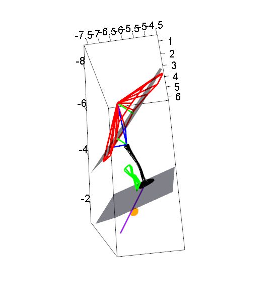

# Ear-measures

This set of R scripts calculates various 3D linear measurements, angles, and surface areas from 3D coordinate input in the form of *.fcsv (Slicer) or *.pp (MeshLab) files. The coordinates were taken from microCT scans of ears, but can be applied to other 3D coordinate data. The import of coordinate data and the export of calculated values and computed coordinates are automated. The outputs are csv files with the computed values, csv file with the angles of interest, . In addition, there are scripts to plot wireframe diagrams based on the coordinates using the ‘rgl’ package.

Importing the coordinates and running the calculation scripts:
> Import, calculate and export MASTER.R

Example input coordinates are in the 'Input' folder. The inputs are a set of fcsv files from 3D slicer and picked point files (*pp) fromMeshlab. 

Calculation files:

> 1_Tympanic membrane area, EC object coltip 2nd position.R - calculations of tympanic membrane area

> 2_Footplate area.R - calculation of footplate area

> 3_Cochlear aqueduct area.R - calculation of cochlear aqueduct area

> 4_Round window area.R - calculation of round window area

> 5_3D planes of best fit and angles between.R - calculation of planes of best fit for the base of the tympanic membrane and the columella footplate, and the angle between these two planes

> 6_Euclid_dist to plane_ EC length_ col length.R - various 3D distance measurements

> 7_Plotting the shortest distance from point to plane - calculations for plotting the shortest distance form a point to a plane

> 8_TM angles and EC_col angle - calculation of angles of the tympanic membrane

Plotting the planes and coordinates as a wireframe diagram:

> plotearauto.R

Combining all measurements and exporting as csv:

> outputs

Outputs are (1) csv with all the calculated values, (2) csv file with the angles of calculated for the tympanic membrane perimeter, (3) a coordinates file with all of the curve coordinates and computed landmarks (e.g. centroids)
